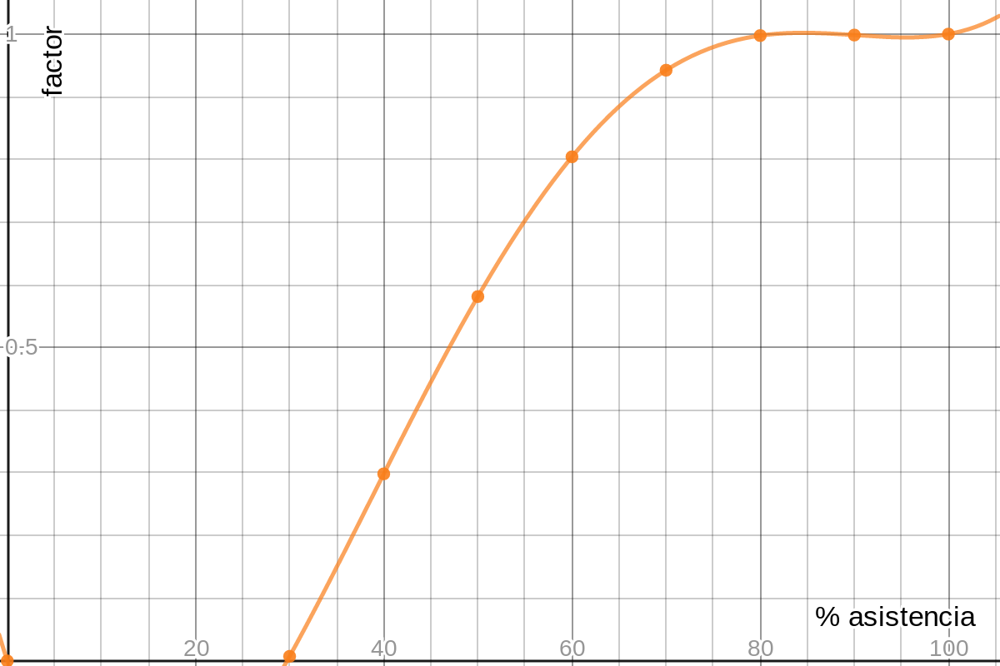

### Profesores

Nombre |  Correo |  Horario Atención | Ubicación 
-----|-----|-----|-----
Daira Velandia | daira.velandia@pucv.cl | Martes 16.00 - 17.00 hrs. | Oficina 2
Juan Zamora    | juan.zamora@pucv.cl | Martes 16.00 - 17.00 hrs. | Oficina 4

### Horarios de clases

Ubicación | Horario
-----|-----
Sala 5 | Lunes 14.00 hrs
Sala 5 | Lunes 15.40 hrs

### Contenidos

1. Operaciones matriciales
2. Descomposiciones matriciales
3. Métodos _directos_ para resolver sistemas de ecuaciones lineales
4. Métodos _iterativos_ para resolver sistemas de ecuaciones lineales
5. Ortogonalización y métodos de mínimos cuadrados
6. Procedimientos numéricos para el cálculo de valores y vectores propios

### Apuntes

* [Sesion 1](apuntes/ce2_01.pdf)
* [Sesion 2](apuntes/ce2_02.pdf)
* [Sesion 3](apuntes/ce2_03.pdf)

### Planificación de las sesiones

<iframe width="600" height="900" frameborder="0" src="https://docs.google.com/spreadsheets/d/e/2PACX-1vRijHUvOETJ3DsuaH5_6jo4bURRLPFnw6mMgmCY_gyGqqz2QhsQAFpRVk1MukjxonpGaUiaDrw7zotA/pubhtml?gid=0&amp;single=true&amp;widget=true&amp;headers=false"></iframe>

### Evaluaciones del curso

* Para las unidades 2 y 3 del curso se entregará un proyecto a desarrollar (máximo 2 integrantes). Una serie de hitos de avance serán definidos previamente por cada proyecto junto con su respectiva fecha de evaluación. 
* Asistencia obligatoria y en base a esta, se entregará un factor que ponderará la nota final. Para esto se usará la siguiente expresión sobre el porcentaje (entre 0% y 100%) de sesiones asistidas __s__:

<iframe src="https://www.desmos.com/calculator/wcbcn7dyd3?embed" width="300px" height="300px" style="border: 1px solid #ccc" frameborder=0></iframe>

* Consideran las 3 evaluaciones junto con las notas de cada uno de los dos proyectos, la nota final previa al examen se calcula como indica la expresión:

### Normas

### Recursos disponibles

* Ver sección de [apuntes del curso](#apuntes)
* Gentle, J.E. (2007). Matrix Algebra: Theory, Computations and Applications in Statistics. Springer, New York.
